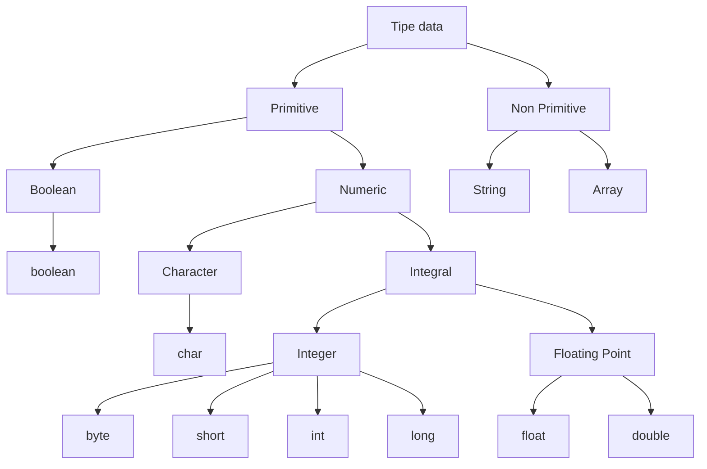

# Diagram

```mermaid
graph TD
  TipeData[Tipe data] --> Primitif[Primitive]
  TipeData --> NonPrimitif[Non Primitive]
  Primitif --> Boolean[Boolean]
  Boolean --> Boolean2[boolean]
  Primitif --> Numeric[Numeric]
  Numeric --> Character[Character]
  Character --> char[char]
  Numeric --> Integral[Integral]
  Integral --> Integer[Integer]
  Integer --> byte[byte]
  Integer --> short[short]
  Integer --> int[int]
  Integer --> long[long]
  Integral --> FloatingPoin[Floating Point]
  FloatingPoin --> float[float]
  FloatingPoin --> double[double]
  NonPrimitif --> String[String]
  NonPrimitif --> Array[Array]
```
